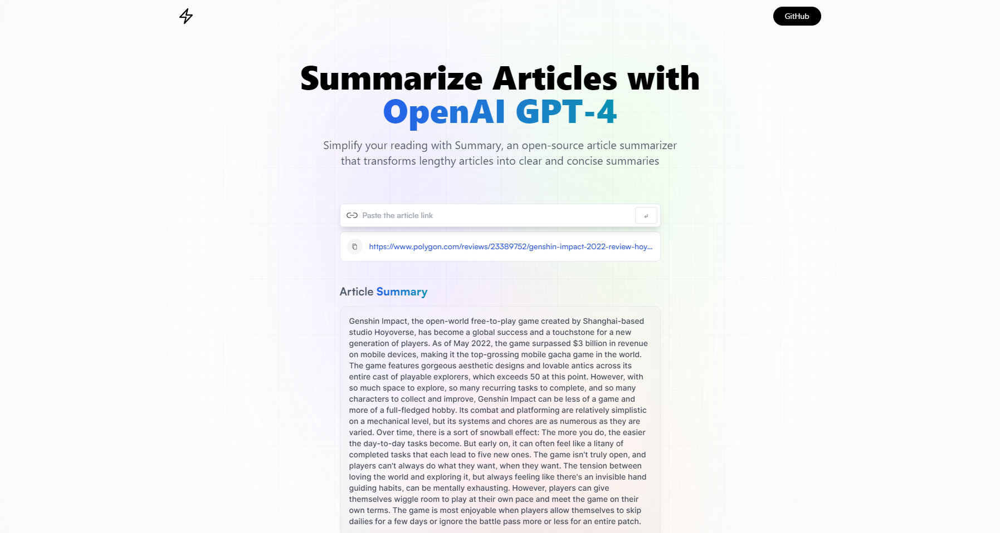

## AI Article Summarizer project

## Overview

This application is about inputting any news articles into the field and the AI will summarize for you in shorten and concise format. It is developed using react, redux and using a third party api from rapid api

## Site URL

[https://aquamarine-chimera-41f377.netlify.app/](https://aquamarine-chimera-41f377.netlify.app/)